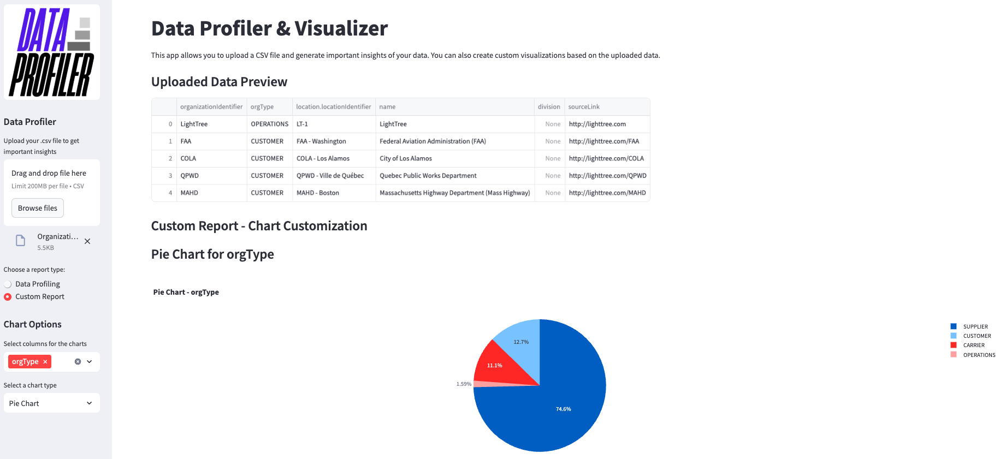

# Data-profiler
Generate important insights about your data by uploading your .csv file with this tool. You also have the option to create custom report by selecting "Custom Report".


## Why you might need this tool?
Sometimes, you might be in a situation where you need to quickly analyze data and extract key insights. In such cases, this tool proves to be extremely helpful.

## About Custom Reporting
You might want to go a step further by creating a report based on a selected column. For this, you can use the Custom Report option, which allows you to generate graphs such as Pie Charts, Bar Charts, Line Charts, or Scatter Plots. Below is an example of such a report.



## Use cases
There can be several use cases as long as your data is in .csv format. One important example where this tool can be especially useful is in analyzing incident data, deployment data, and similar datasets to quickly extract key insights.

## Important Note
Currently compatible with python 3.11.11, you can use 'conda' (Recommended) to build python 3.11 environment

## Installation
 Run the following command to install all the dependencies
 ```
 pip install -r requirements.txt
```
## Running the application
```
streamlit run generic.py
```
